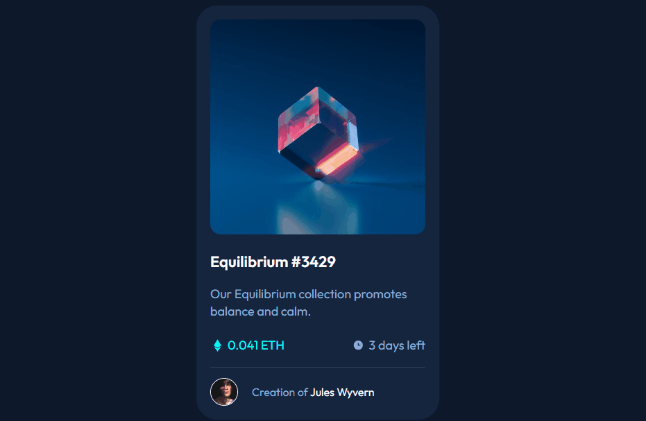

# Componente Cartão NFT
Construção de um componente de cartão NFT.🎴

## Desafio

Os usuários precisam:

- Ver o projeto em qualquer tamanho de tela.
- Identificar e interagir com os elementos em foco.

## Captura de tela em uso

[](https://omarcerqueira.github.io/nft-preview-card-project/)

## Tecnologias Utilizadas

- HTML
- CSS

### Desenvolvimento

- Marcação e semântica de HTML
- Propriedades customizadas de CSS
- Flexbox

### Aprendizado

Durante a contrução do projeto foi necessário, primeiramente, a análise do que poderia ser feito e de que forma seria feito. Desafios foram superados à proporção que o projeto ía tomando forma. Propriedades CSS como before e after foram aperfeiçoadas e utilizadas de forma a incrementar bastante o desenvolvimento. Assim como a flexbox, que também foi utilizada e aperfeiçoada de forma à agregar bastante ao conhecimento sobre a utilização dessa ferramenta. Outra técnica do css de extrema importância que foi utilizada e aprimorada foi a propriedade position.

### Como Utilizar

- Passe o mouse sobre a imagem do cartão, o título ou o nome do criador para visualizar a interação.

    - Trechos de código:

```html
<a class="imagem-link" href="#">
    
</a>
```
```html
<h2 class="titulo"><a class="link-titulo" href="">Equilibrium #3429</a></h2>
```
```html
<a class="nome" href="#">Jules Wyvern</a>
```
```css
.titulo .link-titulo:hover {
    color: var(--primary-medium);
}
```
```css
.creator p .nome:hover {
    color: var(--primary-medium);
}
```

## Autor

- LinkedIn - [Omar Cerqueira](https://www.linkedin.com/in/omar-cerqueira-b83317226/)
- Github - [OmarCerqueira](https://github.com/OmarCerqueira)

## Agradecimentos

Gratidão eterna ao pessoal do Dev em Dobro por me acompanhar nessa incrível jornada do mundo da tecnologia.

- Site - [Dev Quest](https://devemdobro.com)
- LinkedIn - [Dev em Dobro](https://www.linkedin.com/company/dev-em-dobro/)
- Discord - [Guilda Dev em Dobro](https://discord.com/channels/821364094878613524/821364094878613528)
- Github - [devemdobro](https://github.com/devemdobro)